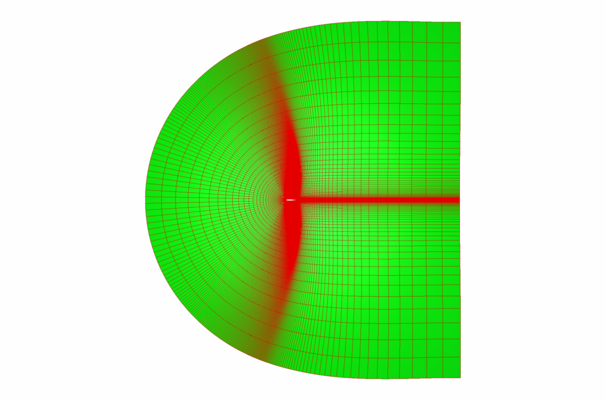
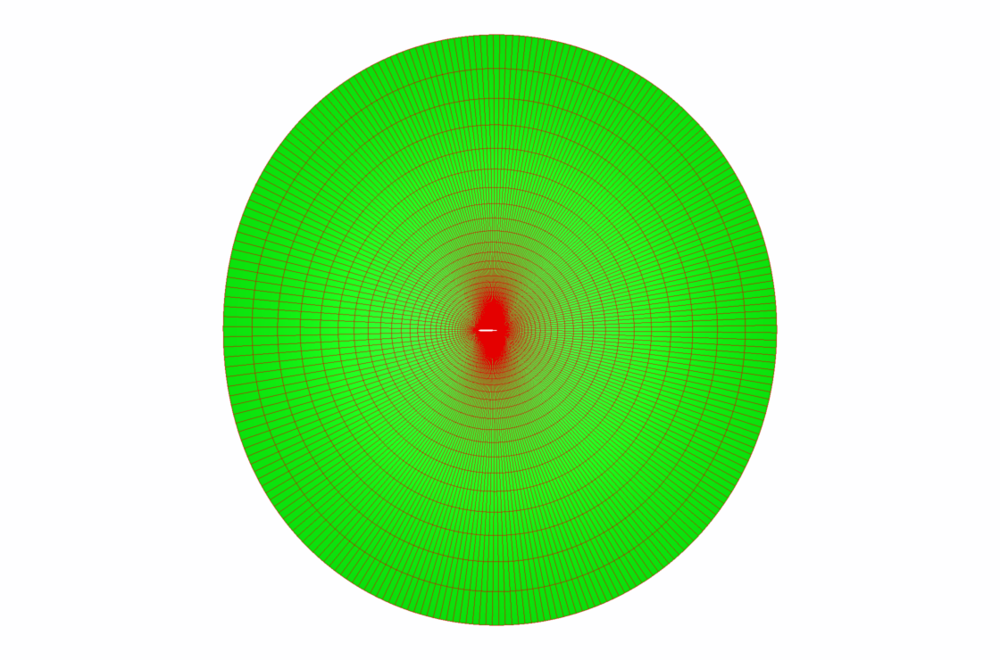

# pyfoil

An arifoil 2D mesh generator based on a python wrapping of [Construct2D](https://sourceforge.net/projects/construct2d/) thanks to [f90wrap](https://github.com/jameskermode/f90wrap).

The 2D strucutred mesh and associted statictics computed by [Construct2D](https://sourceforge.net/projects/construct2d/) core is transformed in a Python/CGNS tree in memory thanks to [Cassiopee](http://elsa.onera.fr/Cassiopee/).

Grid connectivity and BC can be added to the resulting Python/CGNS tree and convert to an NGon unstructured mesh thanks to [Cassiopee](http://elsa.onera.fr/Cassiopee/).

Exemple of C-grid mesh of a naca0012 with sharp trailing edge.


Exemple of O-grid mesh of a naca0012 with blunt trailing edge.


## Requirements

- Python 3 and gcc 8.3
- [f90wrap](https://github.com/jameskermode/f90wrap)
- [Cassiopee](http://elsa.onera.fr/Cassiopee/)

## Build and test

The compilation is done via a Makefile :
```
$> mkdir obj
$> make
```

Run tests with :
```
$> mkdir mesh
$> make test
```

